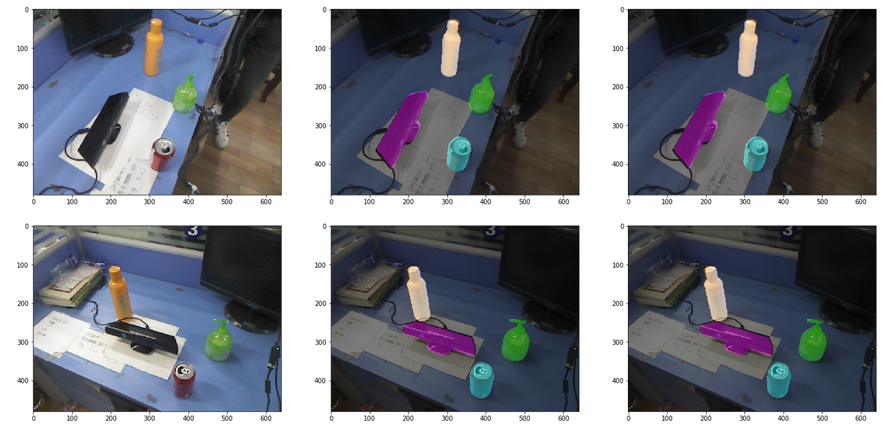
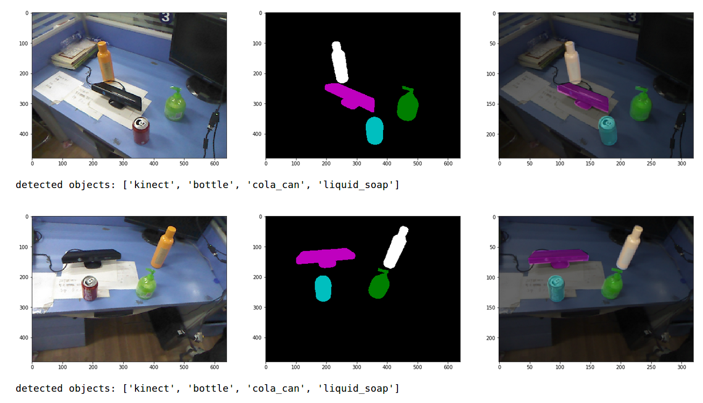

## What can I do:
A end-to-end system for semantic segmentation and object pose estimation (handle symmetrical objects) runs in real-time (20 Hz) on live RGB data, without using depth information or ICP refinement.

### Demo of segmentation:


From left to right: input image, output segmentation and ground truth.

### Demo of object pose estimation

From left to right: input image, output segmentation and pose predictions.

## Overview

File or Directory | Purpose
--- | ---
[`segmentation`](segmentation) | Training, evaluating, and visualizing segmentation models on real RGB data
[`pose_estimation`](pose_estimation) | Training, evaluating, and visualizing pose estimation models (pose interpreter networks) on synthetic data
[`ros-package`](ros-package) | ROS package for real-time object pose estimation on live RGB data
[`end_to_end_eval.ipynb`](end_to_end_eval.ipynb) | Evaluation of end-to-end model on real RGB data
[`end_to_end_visualize.ipynb`](end_to_end_visualize.ipynb) | Demonstration of end-to-end model on real RGB data

## Requirements

These are the basic dependencies (tested on Ubuntu 16.04.4 LTS) for training and evaluating models. Note that some components, such as the ROS package, may have additional/conflicting dependencies. Please see the corresponding READMEs for the specific requirements.

### Python
- python 3.6
- [pytorch](https://pytorch.org/) 0.4 and torchvision 0.2 (`conda install pytorch=0.4 torchvision=0.2 -c pytorch`)
- `pyyaml`
- `munch`
- [COCO API](https://github.com/cocodataset/cocoapi)
- `pillow`
- `scikit-image`
- `matplotlib`
- `tqdm`
- `jupyter`
- `tensorboardX`
- `tensorflow` (for running TensorBoard)

### Blender

Please install [Blender](https://www.blender.org/) 2.79. There is no need to build from source, you can simply download the prebuilt binary and link it at `/usr/local/bin/blender`.

### Demonstrations

After downloading the pretrained models, please see the following notebooks for demonstrations. In order to run these notebooks, you will need to have all of the requirements listed above installed, including Blender.

Notebook | Purpose
--- | ---
[end_to_end_visualize.ipynb](end_to_end_visualize.ipynb) | Visualize end-to-end model on real RGB data
[segmentation/visualize.ipynb](segmentation/visualize.ipynb) | Visualize pretrained segmentation model on real RGB data
[pose_estimation/demo.ipynb](pose_estimation/demo.ipynb) | Visualize pretrained pose estimation model (pose interpreter network) on synthetic data that is randomly generated on the fly

## Reference

```
@INPROCEEDINGS{wu2018pose,
author={J. Wu and B. Zhou and R. Russell and V. Kee and S. Wagner and M. Hebert and A. Torralba and D. M. S. Johnson},
booktitle={2018 IEEE/RSJ International Conference on Intelligent Robots and Systems (IROS)},
title={Real-Time Object Pose Estimation with Pose Interpreter Networks},
year={2018},
volume={},
number={},
pages={6798-6805},
keywords={Pose estimation;Image segmentation;Three-dimensional displays;Quaternions;Real-time systems;Training;Task analysis},
doi={10.1109/IROS.2018.8593662},
ISSN={2153-0866},
month={Oct},}
```
